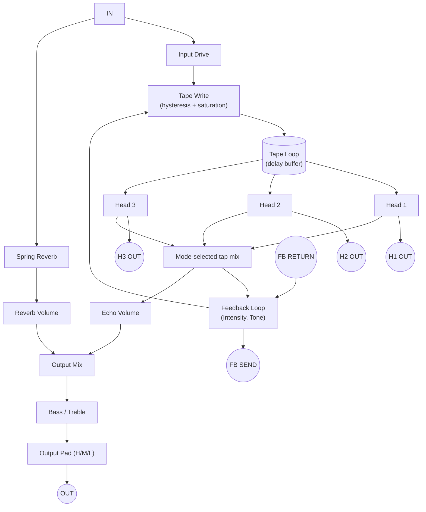

# TAPE ECHO

*Part of the [Astravox](../README.md) plugin for VCV Rack 2. See the [manual index](MANUAL.md) for the other modules.*

A three-head tape echo and reverb combination, modeled on the classic tape-based echo/reverb units of the 1970s (Roland RE-201 Space Echo and similar machines). Audio is written to a simulated tape loop, read back by three fixed heads, fed back through an intensity-controlled loop, and blended with a spring reverb. The emulation goes beyond a clean delay: tape hysteresis and saturation, wow & flutter, per-pass bandwidth loss, self-oscillation, and a "Tape Age" wear model reproduce the specific imperfections that give tape echo its character — including a self-oscillating feedback loop, a spring reverb tank, and a tape that degrades exactly like a physical loop does.

Exhaustive measurements were made to accurately capture real tape delay hardware characteristics to produce a convincing tape echo unit of the era. Extensive time and patience were committed in the pursuit of absolute authenticity. We hope you enjoy the results!

---

## Signal Flow Overview

Echo Volume and Reverb Volume mix the tap signal and the spring reverb into the shared output stage; Bass/Treble and the Output Pad apply to the combined signal on the way to OUT. The feedback loop (Intensity) re-writes the tapped signal back onto the tape loop, so repeats compound — at high Intensity the loop can sustain or self-oscillate. The spring reverb is fed directly from IN, in parallel with the tape path, gated on whenever the selected Mode includes reverb — it is not derived from the tap mix.

---

## Inputs

| Jack | Description |
|------|-------------|
| **IN** | Audio input. Driven by the INPUT DRIVE knob into the tape's saturation/hysteresis stage. |
| **REVERSE** | Gate input for reverse tape playback. Active while high, in addition to the REVERSE button — either can trigger reverse. |
| **FB RETURN** | Feedback-loop return — re-injects an externally processed signal back into the loop. Insert point and blend mode set in the context menu (**Send/Return**). |
| **RATE CV** | CV for Repeat Rate (tape speed) — or for the Rate nudge trim while clock sync is engaged, see below. |
| **INTENSITY CV** | CV for Intensity (feedback amount). Also drives the rate axis when **Gang** is armed (context menu). |
| **ECHO VOLUME CV** | CV for Echo Volume. |
| **REVERB VOLUME CV** | CV for Reverb Volume. |
| **MODE CV** | 1V/step CV selecting one of the 12 Mode positions. |
| **CLOCK** | Tempo-sync input. Patching a clock here engages clock sync — there is no separate on/off switch; unplugging disengages it. See **Tempo Sync** below. |
| **TAPE AGE CV** | 0–10V linear CV over the 0.0–1.0 Tape Age range. Overrides the right-click Tape Age preset entirely (does not blend with it) while connected. |

---

## Outputs

| Jack | Description |
|------|-------------|
| **OUT** | Main mixed output (echo taps + reverb, through tone and the output pad). |
| **H1 / H2 / H3** | Individual tape-head outputs. |
| **FB SEND** | Feedback-loop send — the signal available for external insert processing before it re-enters the loop via FB RETURN. |

> **H1/H2/H3 carry only the delayed tap, never the dry source** — unlike OUT, which sums dry + wet. Each head stays live even when MODE doesn't route it into the main mix, and bypasses Echo/Reverb Volume, Bass/Treble, the Output Pad, and OUT's final clipping — so on a hot or near-self-oscillating loop, a head can pass a peak that OUT's clip stage caught.

---

## Controls

### Tape Transport

**REPEAT RATE** — Tape speed, continuously variable across the machine's measured speed range (slow → fast), with center at the middle speed. Changing speed also changes delay time and the pitch of already-recorded material still in the loop, exactly as slowing or speeding a physical tape does.

> While clock sync is running (a cable in **CLOCK**), this knob is replaced on the panel by the **Rate nudge** knob — same physical position, different meaning. See **Tempo Sync** below.

**REVERSE** (button) — Reverses tape playback direction. By default this is a latch (press on, press again off); enable **Reverse is momentary** in the context menu to make it hold-to-reverse instead. Also triggerable via the REVERSE gate input, independent of the button's latch/momentary mode.

---

### Tone

**BASS** / **TREBLE** — Shelving EQ on the combined echo + reverb signal before the Output Pad. Centered = flat (0 dB, bit-exact identity when the shelf is centered).

> By default (**Tone in feedback loop** in the context menu, on), Bass/Treble sit *inside* the feedback loop, so their coloration compounds on every repeat — the RE-201-faithful behavior, where a tone-shaped echo gets progressively more colored the longer it repeats. Turning this off moves Bass/Treble to a one-shot EQ on the final output only.

---

### Feedback

**INTENSITY** — Feedback amount for the tape loop. Low settings give a few clean repeats; high settings sustain and can drive the loop into self-oscillation. Once self-oscillation is established, the loop holds and can grow in intensity — reducing the knob will reduce the oscillation, either immediately if quickly moved, or gradually with a slower motion.

> Past roughly 85% of the knob's travel the loop gain is deliberately pushed beyond the measured unity-gain crossing, so the top of the range slams into saturation for a "scary," runaway self-oscillation. It swells in gradually but releases promptly when you back off.

**INPUT DRIVE** — Input gain into the tape's saturation stage, is feeding the feedback loop as well: above noon, Input Drive boosts loop gain, so pushing it up drives a given Intensity setting further toward self-oscillation (wilder repeats at the same Intensity), not just a louder signal.

> A balance of **Input Drive** and **Intensity** settings will contribute to where self-oscillation occurs. Experimenting with these two parameters is encouraged.

**GANG** (context menu: **Gang Intensity → Rate**) — Links Intensity and the rate axis (Repeat Rate, or the Rate nudge while synced) as one performance gesture. Intensity is the handle; grab and drag it and the rate knob follows proportionally. The gesture is relative: it starts from wherever your patch currently sits, and both knobs reach their extremes together within one grab. Hold **⌘ on Mac; Ctrl on Windows/Linux** as a temporary toggle while dragging Intensity to reposition it alone, without moving the rate axis. **Gang springs back on release** (its own menu item) returns both knobs to their starting position when you let go — this is forced on while clock sync is running (shown ticked and greyed), since a synced Gang gesture is the only way back to the grid. A synced Gang gesture temporarily suspends the Rate nudge's usual ±6% limit, so that the twist effect can take precedence.

---

### Reverb

**REVERB VOLUME** — Level of the spring reverb send into the output mix.

**Reverb follows Reverse** (context menu) — When on, the spring reverb crossfades toward a reversed-swell character while REVERSE is active (off in Eco mode). Off by default.

---

### Mode

**MODE** — 12-position rotary selecting which tape heads (and reverb) feed the output:

| Position | Selection |
|---|---|
| 0 | Reverb only |
| 1 | Tap 1 |
| 2 | Tap 2 |
| 3 | Tap 3 |
| 4 | Tap 2+3 *(default)* |
| 5 | Tap 1 + Reverb |
| 6 | Tap 2 + Reverb |
| 7 | Tap 3 + Reverb |
| 8 | Tap 1+2 + Reverb |
| 9 | Tap 2+3 + Reverb |
| 10 | Tap 1+3 + Reverb |
| 11 | Swell (all heads + Reverb) |
|||

**MODE TAP CHART** — A quick-reference chart is printed to the left of the Mode knob, showing the same information as the Mode table above at a glance: the mode number runs across the top, each head is labeled on the left, and a vertical tick marks which head(s) are addressed in a given mode. Hovering the Mode knob gives the same information in the tooltip.

> **While clock sync is running, the Mode pointer can move on its own** — with a clock patched, the pointer shows which head sync is actually anchoring to, which is not necessarily the position you parked it at. Your setting underneath is unchanged; only the indicator moves, because sync anchors the timing grid to one specific head and which head that is depends on the division chosen. Hovering the knob while synced shows only the synced value — your parked setting isn't restated, since it's still saved with the patch either way and comes back, on the pointer and in the tooltip, the moment you unpatch the clock. 

---

### Output

**ECHO VOLUME** — Level of the tape-head tap signal (the selected Mode taps) into the output mix.

**Output Pad** (H/M/L switch) — A true output-level pad on the final mix: **L** (−12 dB), **M** (−6 dB), **H** (0 dB, default), and an homage to my favorite tape delay unit.

---

## Tempo Sync

Patching a clock into the **CLOCK** input engages tempo sync — there is deliberately no separate menu toggle, so the cable itself is the unambiguous statement of intent. Unplugging disengages it.

Select a mode, either echo-only, + reverb modes or a multi-head mode and then select a tempo division in the context menu. The nearest tap will be calculated based on your selections.

- **Without sync, the module is closer to the physical machine.** Sync trades the unit's own measured head geometry for an exact musical grid — it's a modular liberty layered on top, not a "more accurate" mode. You are given the freedom to choose: tune by ear or use a tempo accurate grid.
- **The division you choose selects a note value**, resolved against the incoming clock tempo. Set it via the context menu's **Tempo Sync** submenu. Not every division is reachable at every tempo — unreachable ones are shown greyed out with the reason provided (too long/too short at the current BPM).
- **In multi-head modes, the division describes the referenced tap**, which is not necessarily the first one — see the Mode tooltip behavior above.
- **While synced, the Repeat Rate knob is replaced by the Rate nudge knob** — a bounded trim of **±6%** around the exactly-on-grid speed, centered at 0%. Nudge is tempo-invariant (the same +3% feels the same at any tempo or division), and it changes actual delay *time*, not a fixed offset — so at high Intensity the repeat tail progressively slides off the grid rather than snapping back, which is the more tape-like behavior. At low intensity, nudge can be used to either push the beat or create a lazy feel. Right-click the knob and type `0` to re-lock exactly on the grid (only exact if no Rate CV is patched), or double-click to snap back to center — the quicker option, since center *is* the default.
- **What the nudge is good for depends on Intensity, because it's a speed trim, not a fixed offset — so it's really two different tools.** At low Intensity, only a repeat or two survives before decaying out, so an off-center nudge reads as a stable, consistently pushed or dragged feel on the echoes you actually hear. At high Intensity, with many repeats compounding the same drift, the same knob behaves more like a tape-varispeed performance gesture — grab it, bend the time, let go — than a settable swing amount that holds steady at every setting. It isn't a general-purpose "always X% behind the beat" control; treat it as a low-Intensity feel knob or a high-Intensity gesture, not both at once.
- **Polyrhythms emerge from the head spacing.** A 3-based head relationship meeting a 3-based clock division lands on 9/n. Straight divisions keep every head straight; dotted divisions put secondary heads on polyrhythmic 9/n values; triplet divisions cancel the 3s and land secondary heads back on straight values — an emergent, genuinely useful device, not something dialed in directly. Which heads are affected depends on which head the division is anchored to.
- **Clock multiplier** (in the same submenu) scales the incoming clock tempo before dividing, for reaching sync ranges the raw clock tempo can't otherwise hit.

---

## Context Menu Options

Right-click the module panel to access:

**Eco mode (4× saturation oversample)** — Reduces the saturation stage's oversampling for lower CPU use. Trades a small amount of saturation fidelity for headroom in large patches.

**Machine noise floor** — Adds the tape machine's own measured noise floor to the signal. On by default; disable for a cleaner, quieter echo.

**Reverse is momentary** — Off by default (REVERSE latches: press on, press again off). With it selected, hold-to-reverse instead, release to return to forward.

**Gang Intensity → Rate** — See **Feedback** section above.

**Gang springs back on release** — Returns both Gang-linked knobs to their pre-gesture position on mouse release. Forced on (shown ticked and greyed out) while clock sync is running.

**Reverb follows Reverse (off in Eco mode)** — See **Reverb** section above.

**Tempo Sync** — Submenu: current clock tempo (and, if a multiplier is active, the resulting sync tempo), the note-value division list (unreachable divisions greyed out with a reason), and **Clock multiplier**. See **Tempo Sync** above.

**Output: wet only (effects send)** — Defeats the dry path so OUT carries only the wet echo/reverb signal — useful for using Tape Echo as an effects send.

**Tone in feedback loop (per-repeat)** — See **Tone** above.

**Send/Return** — Submenu controlling how FB RETURN re-enters the signal path:
- **Insert point:** **In-loop (compounds)** *(default)* re-inserts before the delay, so the processed return compounds on every future repeat, like a real dub technique. **Output only (isolated)** re-inserts after the delay, isolated from the loop.
- **Return mode:** **Replace** *(default)* substitutes the processed return for the target signal. **Sum** adds the return to the unprocessed target instead (no gain compensation) — for layering an external effect on top rather than replacing the signal.

> **Watch your gain staging in the Send/Return loop — it's easy to build feedback here.** With the default In-loop insert point, whatever comes back through FB RETURN becomes part of the actual regenerating loop: it's still multiplied by INTENSITY's feedback gain (which itself climbs well past unity toward the top of the knob) on every future repeat, on top of whatever gain or resonance the outboard device adds. Two feedback sources compounding together build much faster than either one alone. Start with the outboard device near unity and INTENSITY moderate, then bring both up together rather than driving either one hot first.

**Tape age preset** — Sets the baseline Tape Age (wear) level, used whenever TAPE AGE CV is unpatched:

| Preset | Value | Equivalent CV |
|---|---|---|
| Mint *(default)* | 0.00 | 0 V |
| Slightly aged | 0.15 | 1.5 V |
| Lightly worn | 0.30 | 3.0 V |
| Worn | 0.50 | 5.0 V |
| Well-worn | 0.60 | 6.0 V |
| Thrashed | 0.80 | 8.0 V |
| Dumpster | 1.00 | 10.0 V |

**Drive tilt** — Scales the character of the INPUT DRIVE knob across three presets — **Gentle**, **Moderate** *(default)*, **Aggressive** — trading off drive amount and high-frequency rolloff together while volume swing stays consistent (±6 dB) across all three.

---

## Tape Age — how the tape wears

Tape Age isn't a single "more distortion" knob — it drives several linked effects (HF rolloff, hysteresis drive shift, wow/flutter depth, and, above the halfway point, sporadic dropouts) that together model a physically worn loop:

- **Every Tape Echo instance gets its own tape.** The defect layout — how many bad spots there are, where they sit around the loop, and how severe each one is — is drawn once when the module is created, and stored with the patch. Two instances in the same patch have two different tapes; a fresh module gets a fresh tape. If you like the tape you got, save the patch — there's no way to re-roll it short of adding a new module instance, same as swapping a real tape.
- **Tape Age makes the tape's own defects worse — it doesn't move or add new ones.** Turning Age up deepens the bad spots that tape already had, rather than scattering fresh ones around the loop. The *character* of the degradation belongs to the module instance; only its *severity* follows the knob (or CV).
- **Defects recur once per tape loop, not once per echo** — the loop is on the order of 9–24 seconds depending on Repeat Rate, far longer than any individual echo, so a bad spot returns against different material each time rather than locking to the repeat rhythm.
- **Below the halfway point of Tape Age there are no dropouts at all** — they begin above 0.5 and deepen from there. A dropout is never full silence; even at maximum severity it leaves a ghost of the signal (roughly −20 dB).
- **Patching Tape Age via CV overrides the preset entirely, not additively** — see the CV table above. The CV range is 0–10V.

---

## Tips

- **Stereo delay with a centered dry source:** H1/H2/H3 are delay-only and stay live regardless of MODE, so route a head (or multiple heads) to an external mixer panned hard left/right for a stereo spread of repeats, and feed the output directly to a mixer channel panned center — it already carries the dry source. Set MODE to one of the Reverb + echo settings (5–11), not Reverb only (0) — Intensity has no effect on the head outputs in Reverb-only mode. Turn ECHO VOLUME down. Adjust REVERB VOLUME so OUT carries just the spring reverb with the dry signal — blend that in to taste, or leave Reverb Volume at 0 for a pure dry-center, stereo-delay patch with no reverb at all. Intensity controls how long the repeats sustain on the panned head outputs — perform Intensity moves live for real-time dynamic oscillation that follows through to the heads. 
- **Classic slap-back:** Set MODE to 1 or 2 (single tap), keep Intensity low (a couple of repeats), and use a fast Repeat Rate for tight slap-back echo.
- **Self-oscillating drones:** Push Intensity past the runaway threshold near full and feed a short transient into IN — the loop takes over and sustains on its own. Back Intensity off gradually rather than snapping it, since the loop holds on below where it started oscillating.
- **Performance sweeps with Gang:** Arm Gang, leave Spring-back on, and grab Intensity for a classic "sweep into chaos and spring back" gesture — the rate  follows automatically.
- **Pushed or dragged feel:** Sync to a clock, keep Intensity low so only a repeat or two survives, and offset the Rate nudge knob a couple ticks off-center. At low Intensity the drift stays small enough to read as a stable, consistently rushed or laid-back echo instead of a runaway pitch slide.
- **Tape-scoop gesture:** Sync to a clock with Intensity high enough to sustain several repeats, then twist the Rate nudge knob during the tail for a swooping, tape-varispeed pitch bend — a performance move, not a setting; return to center (or double-click) to let it settle back onto the grid.
- **Send/return with an external effect:** Patch FB SEND to an external effect and its output back to FB RETURN, with **Insert point** set to In-loop, to have that effect compound on every repeat — genuine dub-style processing. A lowpass or bandpass filter works well in this application. With **Insert point** set to Output-only and **Return Mode** set to Sum, attach a reverb unit. Reverb will be added to the delay taps.
- **A tape that feels used:** Set the Tape Age preset to Well-worn or Thrashed and leave Machine noise floor on for a loop that sounds like it's being run through a machine on its last legs, complete with occasional dropouts.

---

## Troubleshooting

**No output sound:**
- Check that IN is receiving audio. INPUT DRIVE never fully mutes the signal — even at its minimum it only attenuates (roughly −12 to −24 dB depending on Drive tilt), so a low setting alone shouldn't cause true silence; if you hear nothing at all, look elsewhere on this list.
- Check that ECHO VOLUME or REVERB VOLUME (or both) is > 0, and MODE isn't parked somewhere unexpected.
- If **Output: wet only** is enabled in the context menu, there is no dry path — that's expected for effects-send use.

**Head outputs (H1/H2/H3) sound harsher, or pass a peak, that OUT doesn't:**
- Expected. The head taps come straight off the tape and skip everything that shapes OUT — Echo Volume, the head-averaging mix law, the Output Pad, and OUT's soft-clip and limiter stages. So they will pass peaks OUT's clipping caught, and read harsher when the loop is hot or near self-oscillation. Pad or limit them externally if needed.
- Don't assume they're the *louder* jack, though. With the Output Pad at 0 dB, OUT is normally louder — it carries the dry signal and any reverb alongside the echo, where a head output is a single echo tap on its own. What flips that is the Output Pad and Echo Volume: neither one touches the head outputs, so turning either down drops OUT while the heads stay exactly where they were. That's when a head can end up hotter than OUT.

**Intensity (or a full Gang sweep) won't push the loop into self-oscillation, no matter how far you turn it:**
- Some Mode/Speed combinations genuinely never self-oscillate on their own — that's faithful to the hardware this module is measured from, not a malfunction. Try a different Mode or Repeat Rate, or feed in a short transient to kick-start the loop rather than relying on Intensity alone from silence.

**Loop won't stop self-oscillating even after backing off Intensity:**
- This is measured behavior — an established oscillation holds on below the level that first triggered it. Back Intensity off further, or toward zero briefly, to fully release it.

**Rate nudge behaves unexpectedly:**
- **Doesn't land exactly on the grid:** confirm no cable is patched into RATE CV — the exact-lock behavior (right-click, type `0`) only holds with no CV summing on top of the nudge.
- **Double-click did something you didn't expect:** the same knob position means two different things depending on sync. Synced, double-click re-locks the Rate nudge to the grid (0%). Unsynced, that same spot is the plain Repeat Rate knob, and double-click resets tape *speed* to its center detent instead — a completely different action. If you've learned "double-click re-locks," it'll catch you off guard the first time you try it with no clock patched.

**Feedback rhythm in a synced multi-head Mode sounds different than expected:**
- Which heads land as straight, dotted, or triplet depends on which head the clock division is anchored to, not just the division you picked — a 3-based head relationship meeting a 3-based clock division produces polyrhythms on some heads while others stay straight (or vice versa). High Intensity makes this more audible since more heads' repeats are sustaining at once. Not a bug — check which head the Tempo Sync submenu shows as the anchor ("Tap N") for your chosen division.

**An LFO on RATE CV seems to stop doing anything at the extreme end of a synced Gang sweep:**
- Expected. CV sums with the param setting; at a full Gang deflection the param sits at its end stop, so CV pushing further outward is flattened while CV pulling back toward center still moves freely — roughly half the LFO cycle does nothing. It's the tape straining against its limit, not a stuck CV input.

**Mode knob shows something different than what you set, or right-click typing doesn't seem to change the display:**
- While clock sync is running, the pointer and tooltip both show which head sync is actually using, not your parked setting — right-click type-in still writes the parked value correctly, it just won't be reflected on the panel until you unpatch the clock. See **Mode** above.

**Reverse doesn't behave as expected:**
- Check **Reverse is momentary** in the context menu — it changes whether the REVERSE button latches or holds, independent of the REVERSE gate input, which always follows the gate directly.

**Everything sounds duller / dirtier than expected:**
- Check the Tape Age preset (or CV). The default baseline is Mint, so if the tape sounds worn, either a preset has been set or TAPE AGE CV is patched — CV overrides the preset entirely whenever it's connected. Set the preset back to Mint, and unpatch the CV, for the cleanest tape.

**A freshly-added instance sounds subtly different from another one with identical settings:**
- Expected — each Tape Echo instance is given its own randomly-placed tape defect layout when it's created, the same way a physical unit's tape has its own wear pattern. It's saved with the patch, so if you like the tape you got, save it; there's no way to re-roll it short of adding a new module instance.

---

## Technical Specifications

| Parameter | Value |
|---|---|
| **Heads** | 3 fixed tape heads, measured spacing ratio ≈ 1 : 2 : 3 |
| **Feedback Loop** | Saturating/hysteresis tape model; measured self-oscillation onset and per-pass bandwidth loss |
| **Reverb** | Convolution-based spring reverb model |
| **Tape Loop Period** | ≈ 9 s (fastest Repeat Rate) to ≈ 24 s (slowest), following Repeat Rate/CV/Gang/Motor Stop |
| **Rate Nudge Range (synced)** | ±6% around grid speed (±34%/+71% during a synced Gang gesture) |
| **Tape Age CV** | 0–10V linear → 0.0–1.0 |
| **Mode CV** | 1V/step, 12 positions |
| **Output Pad** | L: −12 dB, M: −6 dB, H: 0 dB |
| **Output Voltage** | Nominal Eurorack audio level; H1/H2/H3 are unpadded, always-live, delay-only head taps with no soft-clip/limiter of their own |
| **Panel Size** | 20HP × 128.5mm (3U standard) |

---

## Planned Future Releases

- **Stereo Tape Echo.** Tape Echo has one tape and three playback heads. A stereo version could potentially run separate tape paths, each with its own feedback loop, saturation and wear. That is a different machine, so it would arrive as a new module rather than a change to this one.
